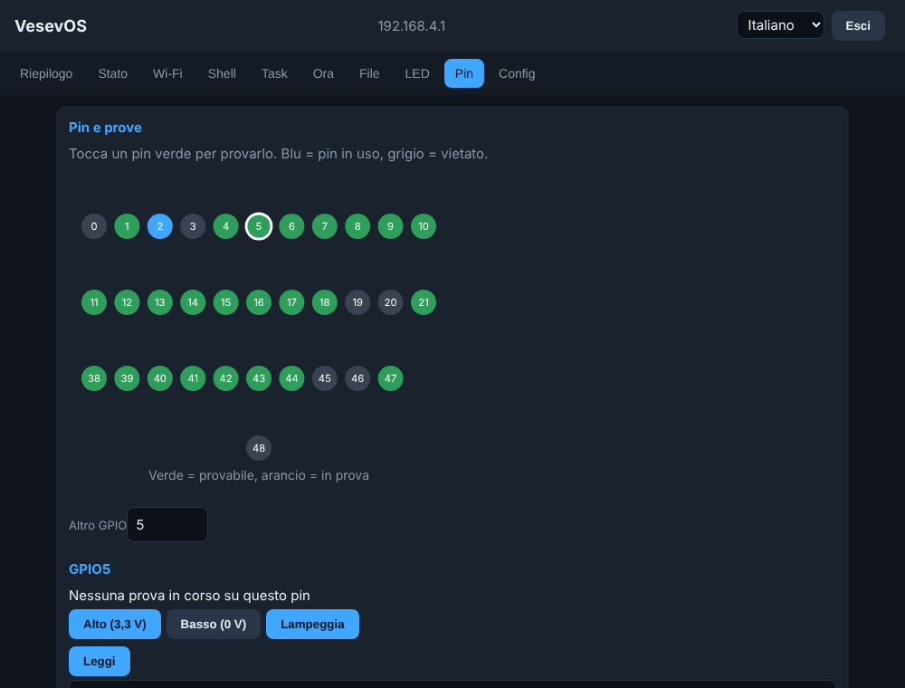
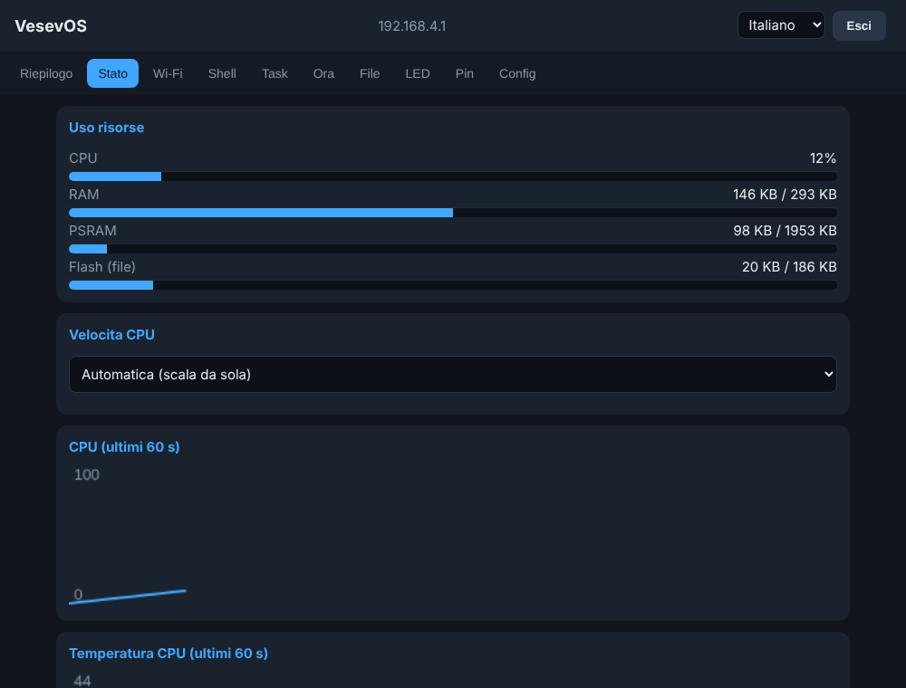

<p align="center">
  
</p>

<p align="center">
  
  
  
  
  
</p>

<p align="center"><a href="README.md">Italiano</a> · <a href="README.en.md"><b>English</b></a></p>

<p align="center"><b>A small operating system for the ESP32-S3: easy to use, secure by default, and useful even where there is no internet.</b></p>

---

## In a nutshell

Plug in the board, open a page in your browser, and you already have a small operating system:
Wi-Fi, clock, files, LEDs, pins, a shell and much more, all protected by a password you choose.
**No cloud, no account, no subscription.** The web page and the languages live inside the board.

<p align="center">
  
  
</p>
<p align="center"><sub>Screenshots of the control page (with sample data; the interface language shown is Italian).</sub></p>

> **Status:** in development (version 1.5.0). The project grows in stages: see "Where we are going".

## Why "VesevOS"?

**Vesevo** (Latin *Vesevus*) is the ancient name of **Mount Vesuvius**, the volcano that has always watched over the Bay of Naples.
We liked it because it tells the idea well: an always-lit energy, small but reliable, that stays in place
even when everything around falls silent. Hence the volcano in the banner.

## Mission

> **To make it simple and safe to turn an ESP32 board into a useful device, even for people just starting out.**

Beginners in electronics often hit a wall: libraries to choose, settings to write, security to invent.
VesevOS removes the wall. It gives you a ready-made, well-built foundation, explained in plain words,
on which to build what you need.

## Vision

> **A common platform for a thousand boards, where each one has its own identity and its own function, chosen by the user.**

Today VesevOS is the **standard base**: the same core for every board. Tomorrow each board will have its own
role (weather station, sensor node, repeater, communication point...) with a guided path to choose the function,
connect "plug and play" accessories and put it to work. We are thinking of boards that work
**even where the network does not reach**: in the countryside on a solar panel, in an emergency,
in radio silence when needed, or communicating in alternative ways.

## Philosophy

| | Principle | What it means |
|---|---|---|
| 🧭 | **Simple first** | Plain words, guided paths, nothing you are forced to understand. Dig deeper if you want to. |
| 🔐 | **Secure by default** | The password protects the page, the shell and the API. Anything risky asks for confirmation. |
| 📴 | **Works without internet** | No cloud dependency. Page, languages and licenses are inside the board. |
| 🔍 | **Open and transparent** | Readable code, no hidden tracking. If statistics are ever needed, they will be **only with your consent**. |
| 🧩 | **Modular** | Only what you need is switched on: every service has its own switch and uses power only when active. |
| 🌍 | **For everyone** | Italian, English, Spanish and German, and a new language is just one file. |
| 🔋 | **Reliable and frugal** | Built to survive blackouts and to use little power, even on battery. |

## What it does today

- **Network**: AP mode (the board creates its own Wi-Fi network) and client mode, automatic or fixed IP, network scan, configurable host name and domain (`name.local` with mDNS).
- **Web page** with tabs: Summary, Status, Wi-Fi, Shell, Tasks, Time, Files, LED, Pins, Config.
- **Pin tests**: tap a pin to set an output high or low, make it blink or read it, with warnings about the risks. The test switches off by itself.
- **Shell**, on the web and on the serial port, with many commands (type `help`).
- **Security**: salted, iterated SHA-256 password, lock-out after 5 mistakes, timed sessions. The password protects the page, the API and the shell.
- **Time**: NTP, time zones, date/time formats, temperature in C or F, local NTP server.
- **Files**: internal memory (LittleFS) with folders, upload/download/edit.
- **CPU**: automatic or fixed speed (80/160/240 MHz), internal temperature, alarm when too hot.
- **LED**: WS2812 RGB LED (system status, heartbeat tied to CPU load, fixed color) and an extra LED.
- **Configuration** in OpenWrt style (`/vesevos.conf`), downloadable and restorable.
- **Languages**: Italian inside the firmware; English, Spanish and German as separate files (`lang/`) that can be loaded from the page without recompiling.
- **Licenses and legal notes** available from the page and from the shell (`license`).

## Where we are going

These are ideas and plans, not promises: the order may change.

**Next releases**
- [ ] **"Control room" home page**: tiles for CPU, memory, disk, temperature, Wi-Fi signal and alarms; one click opens the right tab. Polished graphics with light SVG icons, light, dark or automatic theme.
- [ ] A single **Network** tab (Wi-Fi, IP, name, access point) and a dynamic, sortable **Tasks** tab.
- [ ] A simple **firewall**: blocking of repeated failed logins, rules for addresses, limits on connections.
- [ ] **Advanced pins**: voltage and frequency measurements, PWM, correction of values with a multimeter, animated pins.
- [ ] A more comfortable **web shell** (history, completion, colors).
- [ ] **Firmware update from the page** (OTA).

**Further ahead**
- [ ] **Guided first-time setup** (language, password, country, Wi-Fi, time).
- [ ] **SD card** and **Lua apps** confined to a "cage" on the SD card.
- [ ] **Plug-and-play accessory catalog**: pick the sensor from a list and VesevOS shows how to wire it and installs what is needed.
- [ ] **Board-to-board communication** (ESP-NOW, mesh networks) and alternative channels for emergencies.
- [ ] **Radio silence mode** and **power saving** for solar-powered use.
- [ ] **SSH** server, MQTT, HTTPS.

## Requirements

- An **ESP32-S3 SuperMini** board (ESP32-S3FH4R2: 4 MB flash, 2 MB PSRAM).
- Arduino IDE with **esp32 core 3.3.x** or newer.
- Libraries: **ESP32Async ESPAsyncWebServer** and **AsyncTCP** (ESP32Async).

## Arduino IDE settings

| Item | Value |
|---|---|
| Board | ESP32S3 Dev Module |
| PSRAM | QSPI PSRAM |
| USB CDC On Boot | Enabled |
| Partition Scheme | Minimal SPIFFS (1.9MB APP with OTA/190KB SPIFFS) |

## Installation

1. Download or clone the repository.
2. Open the `VesevOS/` folder (it must contain `VesevOS.ino`) with Arduino IDE.
3. Set the board as in the table, then upload the sketch.
4. Open the serial monitor at 115200 baud to see the start-up messages.

## First access

1. Connect to the Wi-Fi network **VesevOS** (initial password `vesevos123`).
2. Open `http://192.168.4.1`.
3. Choose the board's password (at least 6 characters). It also applies to the serial shell.

**Forgot the password:** hold the **BOOT** button for 8 seconds while the board is already running.
Do not hold it at power-up: the board would enter download mode.

## RGB LED colors ("Status" mode)

| Color | Meaning |
|---|---|
| Orange | Starting up |
| Blue | AP mode (own network) |
| Yellow | Connecting to Wi-Fi |
| Green | Connected to Wi-Fi |
| Flashing red | Alarm (high temperature) |

## Repository layout

```
VesevOS/      Arduino sketch (VesevOS.ino + .h/.cpp files)
web/          web page in HTML (source of vos_page.h)
assets/       README banner and screenshots
lang/         ready-to-load language files (en, es, de) - GENERATED from tools/lang_src.json
licenses/     license texts (GPL, LGPL, Apache) and legal notice template
tools/        mkpage.py (page), mklang.py (languages), mklicense.py (legal texts)
NOTICE.txt    legal notes: ownership, licenses, regulatory references
CHANGELOG.md  version history (in Italian)
```

If you edit `web/index.html`, regenerate the page with:

```
python3 tools/mkpage.py
```

The sources use only ASCII characters (accented letters in the page are HTML entities).

## Languages

Italian is inside the firmware. For the other languages:

1. Open the page, tab **Config > Languages**.
2. Choose the file (`en.json`, `es.json` or `de.json` from the `lang/` folder) and press **Upload language**.
3. Pick the language from the menu at the top right. The board remembers it; from the shell: `lang en`.

Each language takes about 17 KB of internal memory. **To add a language**: copy an entry of
`tools/lang_src.json`, add a column with the new code under `langs` and in the entries, then run
`python3 tools/mklang.py`. The check warns you if any text is missing.

## Contributing

Ideas, tests on real boards and fixes are welcome. A translation too: it is just one file in `lang/`.
For code, read `CONTRIBUTING.md`.

## License

Dual license:

- **GPL v3 or later** (file `LICENSE`): free. Anyone who distributes a modified VesevOS, or one inside a
  product, must publish their code under the same license.
- **Commercial license**: for using VesevOS in closed products. See `COMMERCIAL.md`.

Ownership, third-party library licenses and regulatory references: see `NOTICE.txt` (also on the
page, Config > Licenses tab, and in the shell with `license`).

Copyright (C) 2026 Domenico Paolella.
