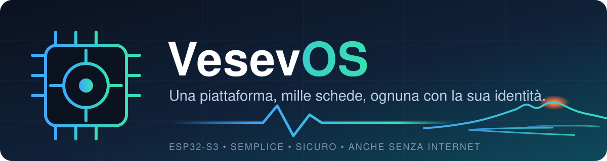
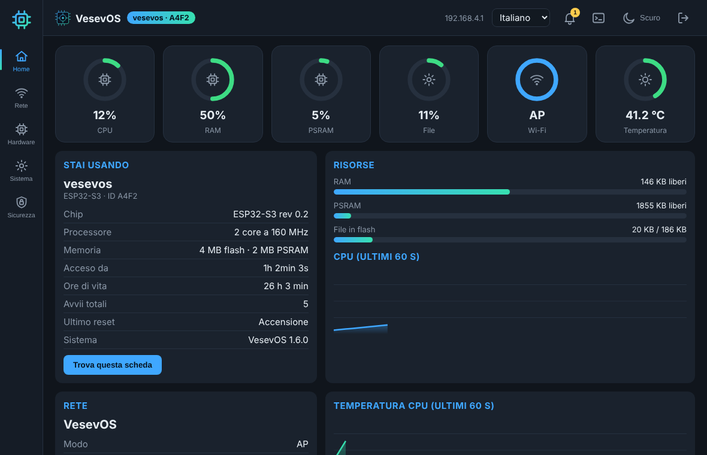
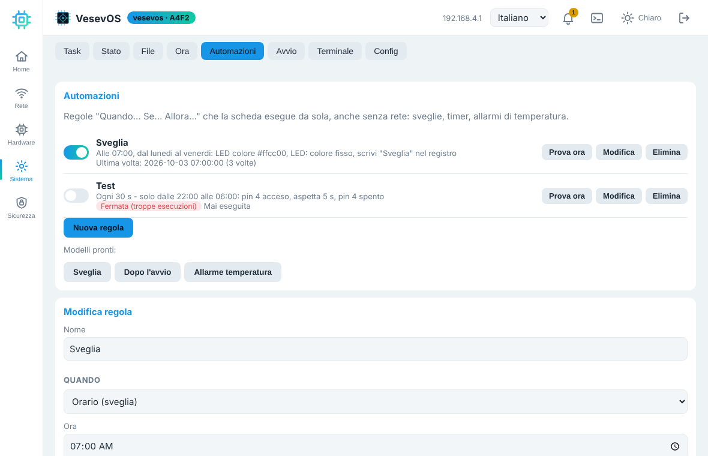
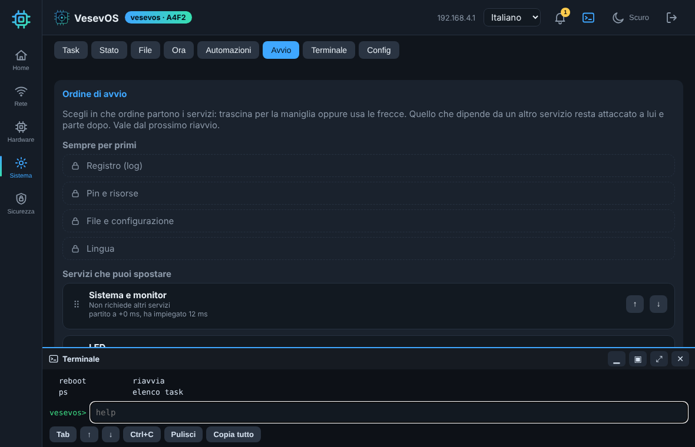
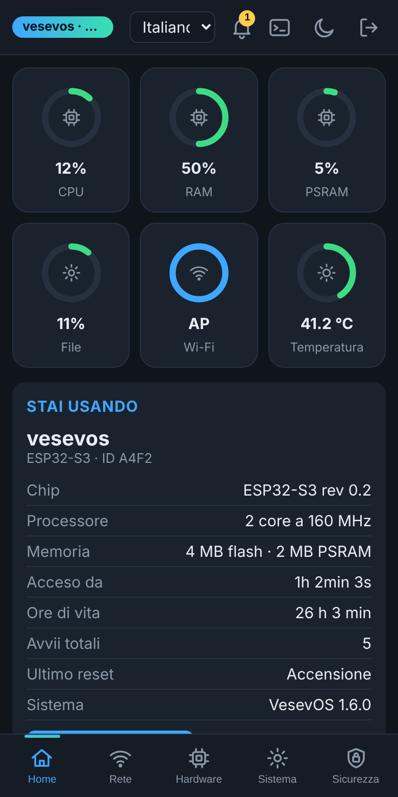

<p align="center">
  
</p>

<p align="center">
  
  
  
  
  
</p>

<p align="center"><a href="README.md"><b>Italiano</b></a> · <a href="README.en.md">English</a></p>

<p align="center"><b>Un piccolo sistema operativo per ESP32-S3: semplice da usare, sicuro per impostazione, utile anche dove internet non c'è.</b></p>

---

## In due parole

Colleghi la scheda, apri una pagina nel browser e hai già un piccolo sistema operativo:
rete Wi-Fi, ora, file, LED, pin, shell e tante altre cose, tutto protetto da una password che scegli tu.
**Niente cloud, niente account, niente abbonamenti.** La pagina e le lingue vivono dentro la scheda.

<p align="center">
  
  
  
  
</p>
<p align="center"><sub>Schermate della pagina di controllo (con dati di esempio): Home in tema scuro, Automazioni, ordine di avvio con il terminale a pannello, e la versione per telefono.</sub></p>

> **Stato:** in sviluppo (versione 1.7.5). Il progetto cresce a fasi: guarda "Dove stiamo andando".

## Perché si chiama VesevOS

**Vesevo** (in latino *Vesevus*) è l'antico nome del **Vesuvio**, il vulcano che da sempre veglia sul golfo di Napoli.
Ci è piaciuto perché racconta bene l'idea: un'energia sempre accesa, piccola ma affidabile, che resta al suo posto
anche quando intorno tutto tace. Da qui il vulcano nel banner.

## Missione

> **Rendere semplice e sicuro trasformare una scheda ESP32 in un dispositivo utile, anche per chi comincia adesso.**

Chi si avvicina all'elettronica spesso si ferma davanti a un muro: librerie da scegliere, configurazioni
da scrivere, sicurezza da inventare. VesevOS toglie il muro. Ti dà una base già pronta, ben fatta e
spiegata con parole semplici, su cui costruire quello che ti serve.

## Visione

> **Una piattaforma comune per mille schede, dove ognuna ha la sua identità e la sua funzione, scelta dall'utente.**

Oggi VesevOS è la **base standard**: il nucleo uguale per tutte le schede. Domani ogni scheda avrà il suo
ruolo (stazione meteo, nodo sensore, ripetitore, punto di comunicazione...) con un percorso guidato per
scegliere la funzione, collegare gli accessori "plug and play" e metterla al lavoro. Pensiamo a
schede che funzionano **anche dove la rete non arriva**: in campagna con un pannello solare, in
una situazione di emergenza, in silenzio radio quando serve, o comunicando in modi alternativi.

## Filosofia

| | Principio | Cosa significa |
|---|---|---|
| 🧭 | **Semplice prima di tutto** | Parole semplici, percorsi guidati, niente da capire per forza. Chi vuole può andare a fondo. |
| 🔐 | **Sicuro per impostazione** | La password protegge pagina, shell e API. Quello che è pericoloso chiede conferma. |
| 📴 | **Funziona senza internet** | Nessuna dipendenza dal cloud. Pagina, lingue e licenze sono dentro la scheda. |
| 🔍 | **Aperto e trasparente** | Codice leggibile, nessun tracciamento nascosto. Se un giorno servirà una statistica, sarà **solo con il tuo consenso**. |
| 🧩 | **Modulare** | Si accende solo ciò che serve: ogni servizio ha il suo interruttore e consuma solo se attivo. |
| 🌍 | **Per tutti** | Italiano, inglese, spagnolo e tedesco, e si può aggiungere una lingua con un solo file. |
| 🔋 | **Affidabile e frugale** | Pensato per reggere i blackout e per consumare poco, anche con la batteria. |

## Cosa fa oggi

- **Rete**: modo AP (la scheda crea la sua rete Wi-Fi) e modo client, IP automatico o fisso, scansione reti, nome host e dominio configurabili (`nome.local` con mDNS).
- **Pagina web** con categorie Home, Rete, Servizi, Periferiche, Sistema, Sicurezza; **prima configurazione guidata** (6 passi, con verifica del Wi-Fi di casa).
- **Prova dei pin**: tocca un pin per mettere un'uscita alta o bassa, farla lampeggiare o leggerla, con avvisi sui rischi. La prova si spegne da sola.
- **Shell** web e seriale con molti comandi (digita `help`).
- **Sicurezza**: password dell'hotspot casuale per ogni scheda, nessuna password di fabbrica, accesso con prova HMAC (la password non viaggia), **HTTPS** con certificato unico, fino a 8 **utenti con ruoli**, blocco per indirizzo IP, **filtro IP**, **controlli della configurazione** con allarmi e registro delle modifiche.
- **Servizi** (spenti di fabbrica): **MQTT** (anche cifrato, mqtts), **rete tra schede** ESP-NOW con messaggi firmati e fino a 3 salti, **Bluetooth** per configurare dal telefono (10 minuti).
- **Watchdog**: riavvia servizi o scheda bloccati, con limite anti-giro.
- **Localizzazione**: paese, canali e potenza della radio secondo le regole del paese, antenna, fuso, formati.
- **Modo aereo** con scelta di come riaccendere la rete, **portale automatico** in modalità hotspot, **sleep** profondo e **registro** con filtro.
- **Ora**: NTP, data e ora a mano, server NTP locale.
- **File**: memoria interna (LittleFS) con cartelle, carica/scarica/modifica.
- **CPU**: velocità automatica o fissa (80/160/240 MHz), temperatura interna, allarme se troppo calda.
- **LED**: LED RGB WS2812 (stato del sistema, battito legato al carico CPU, colore fisso).
- **Configurazione** in stile OpenWrt (`/vesevos.conf`), scaricabile e ripristinabile.
- **Lingue**: italiano e inglese nel firmware (con bandiera, cambio anche dalla seriale con i tasti 1 e 2); spagnolo e tedesco come file separati (`lang/`).
- **Note legali**, elenco del software usato (SBOM) e manuale nella pagina e nella shell (`legal`, `license`). Manuale: [docs/manuale.md](docs/manuale.md).

## Dove stiamo andando

Queste sono idee e progetti, non promesse: l'ordine può cambiare.

**Prossimi rilasci**
- [ ] **Home a "sala di controllo"**: riquadri con CPU, memoria, disco, temperatura, segnale Wi-Fi e allarmi; un clic porta alla scheda giusta. Grafica curata con icone SVG leggere, tema chiaro, scuro o automatico.
- [ ] **Scheda Rete** unica (Wi-Fi, IP, nome, punto di accesso) e **Task** dinamico e ordinabile.
- [ ] **Pin avanzati**: misure di tensione e frequenza, PWM, correzione dei valori con il tester, animazione dei pin.
- [ ] **Shell web** più comoda (cronologia, completamento, colori).
- [ ] **Aggiornamento del firmware dalla pagina** (OTA).

**Più avanti**
- [ ] **Scheda SD** e **app Lua** protette in una "gabbia" sulla SD.
- [ ] **Catalogo di accessori plug and play**: scegli il sensore dall'elenco e VesevOS ti mostra come collegarlo e installa il necessario.
- [ ] **Scheda SD** (1.8.0) e **aggiornamento OTA dalla pagina** (1.8.1).
- [ ] **Modalità silenzio radio** e **risparmio energetico** per l'uso con pannello solare.
- [ ] Server **SSH**.

## Requisiti

- Scheda **ESP32-S3 SuperMini** (ESP32-S3FH4R2: 4 MB flash, 2 MB PSRAM).
- Arduino IDE con core **esp32 3.3.x** o piu recente.
- Librerie (Gestore librerie di Arduino IDE): **PsychicHttp** (3.1.x, MIT) e **ArduinoJson** (7.x, MIT). Non servono piu ESPAsyncWebServer e AsyncTCP.
- Il Bluetooth si puo togliere per risparmiare memoria: `#define VOS_WITH_BLE 0` in `vos_common.h`.

## Impostazioni Arduino IDE

| Voce | Valore |
|---|---|
| Scheda | ESP32S3 Dev Module |
| PSRAM | QSPI PSRAM |
| USB CDC On Boot | Enabled |
| Partition Scheme | Minimal SPIFFS (1.9MB APP with OTA/190KB SPIFFS) |

## Installazione

1. Scarica o clona il repository.
2. Apri la cartella `VesevOS/` (deve contenere `VesevOS.ino`) con Arduino IDE.
3. Imposta la scheda come nella tabella, poi carica lo sketch.
4. Apri il monitor seriale a 115200 per vedere i messaggi di avvio.

## Primo accesso

1. Apri il monitor seriale (115200) e premi RESET: la scheda scrive il nome della rete (**VesevOS**) e la **sua password**,
   diversa per ogni scheda (lo chiedono le leggi sulla sicurezza dei dispositivi: UE RED/EN 18031, Cyber Resilience Act; UK PSTI).
2. Collegati a quella rete e apri `http://192.168.4.1` (di solito si apre da sola).
3. Scegli la password del pannello (minimo 6 caratteri) e segui la configurazione guidata (LED arcobaleno).

**Tasto BOOT** (tieni premuto a scheda accesa, poi lascia): meno di 2 s esce dal modo aereo; 2-7 s (LED azzurro) spegne il filtro IP;
8-19 s (LED giallo) azzera le password degli amministratori e riscrive la password Wi-Fi sulla seriale; 20 s o piu (LED rosso) fabbrica.
Non tenerlo premuto all'accensione: la scheda entrerebbe in modo download. Tutto spiegato nel [manuale](docs/manuale.md).

## Colori del LED RGB (modo "Stato")

| Colore | Significato |
|---|---|
| Arancio | Avvio |
| Blu | Modo AP (rete propria) |
| Giallo | Sto collegandomi al Wi-Fi |
| Verde | Collegata al Wi-Fi |
| Rosso lampeggiante | Allarme (temperatura alta) |

## Organizzazione del repository

```
VesevOS/      sketch Arduino (VesevOS.ino + file .h/.cpp)
web/          pagina web in HTML (sorgente di vos_page.h, compressa gzip)
docs/         manuale (italiano e inglese)
assets/       banner e schermate del README
lang/         lingue in file (es, de) - GENERATE da tools/lang_src.json; l'inglese e dentro il firmware
licenses/     testi delle licenze (GPL, LGPL, Apache, MIT, BSD) e modello della nota legale
tools/        mkpage.py (pagina), mklang.py (lingue), mklicense.py (testi legali), mkcommon.py (elenco dei paesi),
              stub/ (controllo di tutti i file senza scheda: compila.sh), data/ (sorgente dei dati dei paesi)
NOTICE.txt    note legali: titolarita, licenze, riferimenti normativi
SBOM.spdx.json elenco del software usato (formato SPDX)
SECURITY.md   come segnalare problemi di sicurezza, anni di supporto
CHANGELOG.md  cronologia delle versioni
```

Se modifichi `web/index.html`, rigenera la pagina con:

```
python3 tools/mkpage.py
```

I sorgenti del firmware usano solo caratteri ASCII.

## Lingue

L'italiano e dentro il firmware. Per le altre lingue:

1. Apri la pagina, scheda **Sistema > Localizzazione** (carta Lingue).
2. Scegli il file (`en.json`, `es.json` o `de.json` dalla cartella `lang/`) e premi **Carica lingua**.
3. Scegli la lingua dal menu in alto a destra. La scheda la ricorda; da shell: `lang en`.

Ogni lingua occupa circa 17 KB della memoria interna. **Per aggiungere una lingua**: copia una
voce di `tools/lang_src.json`, aggiungi la colonna con il nuovo codice in `langs` e nelle voci,
poi esegui `python3 tools/mklang.py`. Il controllo avvisa se manca qualche testo.

## Contribuire

Le idee, le prove sulla scheda e le correzioni sono benvenute. Anche una traduzione: basta un file in `lang/`.
Per il codice leggi `CONTRIBUTING.md`.

## Licenza

Doppia licenza:

- **GPL v3 o successiva** (file `LICENSE`): gratuita. Chi distribuisce VesevOS modificato, o dentro un
  prodotto, deve pubblicare il proprio codice con la stessa licenza.
- **Licenza commerciale**: per usare VesevOS in prodotti chiusi. Vedi `COMMERCIAL.md`.

Titolarità, licenze delle librerie di terzi e riferimenti normativi: vedi `NOTICE.txt` (anche nella
pagina, scheda Sistema > Note legali, e nella shell con `license`).

Copyright (C) 2026 Domenico Paolella.
